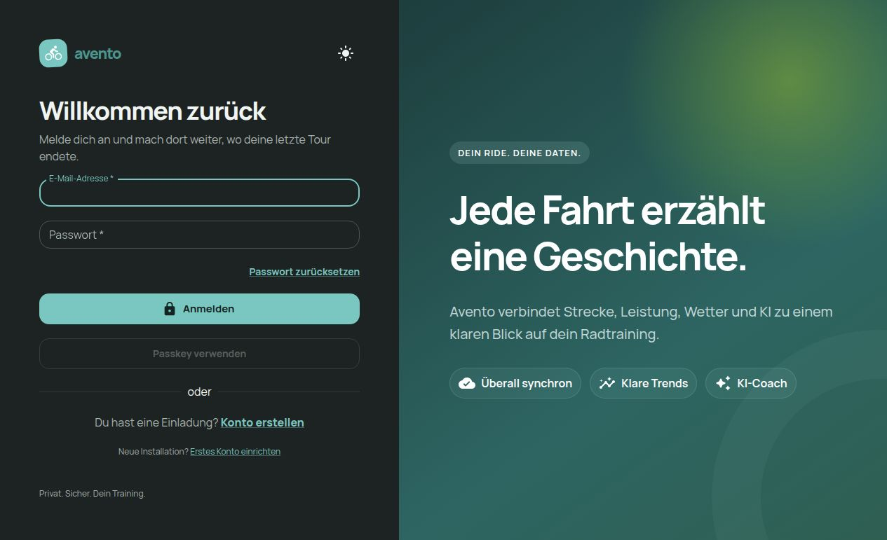
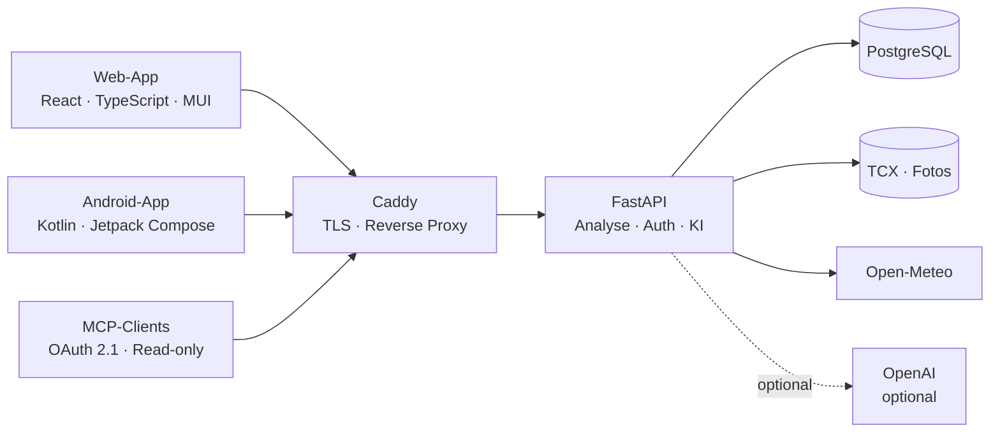

<p align="center">
  
</p>

<p align="center">
  <strong>Deine Fahrten. Deine Daten. Dein Fortschritt.</strong><br>
  Private Radfahranalyse mit Strecken, Wetter, persönlichen Rekorden und optionalem KI-Coach.
</p>

<p align="center">
  
  
  
  
</p>

<p align="center">
  
</p>

<p align="center"><sub>Eine responsive Web-App und eine native Android-App greifen auf dasselbe FastAPI-Backend zu.</sub></p>

---

## Was ist Avento?

Avento ist eine private Full-Stack-Plattform für Radfahranalyse und
Streckenvisualisierung. Importierte TCX-Dateien werden serverseitig gespeichert,
analysiert, entlang der Strecke mit historischen Wetterdaten angereichert und
optional durch einen persönlichen KI-Coach ausgewertet.

| Strecke & Leistung | Training & Fortschritt | Kontext & Erinnerungen | Privat & erweiterbar |
| --- | --- | --- | --- |
| Interaktive Karten, Diagramme und Trackanalyse | Persönliche Rekorde, Trends und Vergleiche | Historisches Wetter, Trinkmenge und Aktivitätsfotos | Self-hosted, Passkeys, OAuth 2.1 und Read-only-MCP |

## Highlights

- **Persönliche Rekorde:** Bestzeiten über 10, 20, 30, 40 und 50 km werden
  direkt aus den Trackpunkten berechnet.
- **Langzeittrends:** Monats- und Jahresvergleiche, Saisonrückblicke sowie
  vorsichtig formulierte Muster zu Wetter, Herzfrequenz, Tempo und
  Aktivitätsabständen.
- **Aktivitätskontext:** Trinkmengen und Fotos lassen sich dokumentieren; Fotos
  werden validiert, als WebP gespeichert und über Aufnahmezeit sowie
  Koordinaten einer Strecke zugeordnet.
- **Nachvollziehbare KI:** Coach-Antworten und KI-Zusammenfassungen nennen
  Zeitraum, Aktivitäten, Kennzahlen, Methoden und bekannte Einschränkungen.
- **Ein gemeinsames Backend:** Web-App, Android-App und MCP verwenden dieselben
  Daten und dieselbe API.

## Architektur



| Verzeichnis | Inhalt |
| --- | --- |
| [`backend/`](backend/) | FastAPI, SQLAlchemy, PostgreSQL, TCX-Analyse, Open-Meteo, OpenAI und Read-only-MCP |
| [`web/`](web/) | React, TypeScript, Material UI, MapLibre und Recharts |
| [`android/`](android/) | Kotlin, Jetpack Compose und Material 3 |
| [`infra/`](infra/) | Caddy als TLS-fähiger Reverse Proxy |

## Schnellstart mit Docker

Vorausgesetzt werden Docker mit Compose sowie eine Domain oder `localhost` für
den ersten Test.

```bash
cp .env.example .env

# POSTGRES_PASSWORD, SECRET_KEY, BOOTSTRAP_INVITE_CODE und PUBLIC_URL setzen.
# Für POSTGRES_PASSWORD einen langen, zufälligen alphanumerischen Wert verwenden.

docker compose up --build -d
```

Danach ist Avento unter der in `PUBLIC_URL` gesetzten Adresse erreichbar. Mit
dem `BOOTSTRAP_INVITE_CODE` wird das erste Administratorkonto erstellt.

Ohne `OPENAI_API_KEY` erzeugt Avento eine lokale, regelbasierte
Zusammenfassung; alle übrigen Funktionen bleiben vollständig nutzbar.

Eine kleine TCX-Beispieldatei zum Ausprobieren liegt unter
[`examples/sample-ride.tcx`](examples/sample-ride.tcx).

## Lokale Entwicklung

<details>
<summary><strong>Backend starten</strong></summary>

```bash
cd backend
python -m venv .venv
. .venv/bin/activate
python -m pip install -e '.[test]'
cp .env.example .env
uvicorn app.main:app --reload
```

</details>

<details>
<summary><strong>Web-App starten</strong></summary>

```bash
cd web
npm install
npm run dev
```

</details>

<details>
<summary><strong>Android-App bauen</strong></summary>

```bash
cd android
./gradlew testDebugUnitTest assembleDebug
```

Beim ersten Start fragt die App nach der Adresse des Avento-Servers. Die
erzeugte Debug-APK liegt unter
`android/app/build/outputs/apk/debug/app-debug.apk`. Weitere Hinweise stehen in
[`android/README.md`](android/README.md).

</details>

## Read-only-MCP

Avento stellt seine Trainingsdaten über einen schreibgeschützten
Streamable-HTTP-Endpunkt bereit. Entfernte MCP-Clients verwenden OAuth 2.1 mit
Authorization Code, PKCE und automatisch rotierenden Refresh-Tokens. Beim
ersten Verbinden öffnet sich der Avento-Login mit einer Scope-Freigabe.

```toml
[mcp_servers.avento]
url = "https://deine-avento-domain.example/api/v1/mcp/rpc"
```

| Endpunkt | Zweck |
| --- | --- |
| `/api/v1/mcp/rpc` | Streamable HTTP für MCP-Clients |
| `/.well-known/oauth-protected-resource` | Protected-Resource-Metadaten |
| `/.well-known/oauth-authorization-server` | OAuth-Server-Metadaten |

`PUBLIC_URL` muss auf die vom MCP-Client erreichbare HTTPS-Adresse zeigen. Für
abweichende Setups kann `MCP_RESOURCE_URI` gesetzt werden.

Der bisherige Secret-Flow bleibt für bereits eingerichtete Clients erhalten.
Administratoren verwalten diese Legacy-Clients unter `/administration/mcp`;
Secrets und Tokens werden ausschließlich gehasht gespeichert. Jede
MCP-Anfrage wird ohne Roh-Tokens oder Secrets im Audit-Log erfasst.

Für einen ausschließlich lokal erreichbaren MCP-Prozess kann im
Backend-Verzeichnis zusätzlich `python mcp_server.py` gestartet werden. Er
bindet standardmäßig an `127.0.0.1:8765`.

## Qualität, Backup und Restore

```bash
make test
make backup
```

Uploads und PostgreSQL-Daten liegen in Docker-Volumes. `scripts/backup.sh`
sichert die Datenbank, originale TCX-Dateien und Aktivitätsfotos im lokalen
Verzeichnis `backups/`. API-Schlüssel, Passwörter und Tokens gehören
ausschließlich in `.env` und niemals ins Repository.

Ein vollständiges Restore überschreibt die aktuelle Datenbank und das
Upload-Volume:

```bash
make restore BACKUP_DB=backups/avento-<zeitstempel>.dump \
  BACKUP_UPLOADS=backups/avento-uploads-<zeitstempel>.tar.gz
```

Das Restore-Skript verlangt vor dem Überschreiben die Eingabe `RESTORE`.

---

<p align="center">
  
</p>

<p align="center">
  <strong>Dieses Projekt wurde zu 99 % von GPT-5.6 Luna/Sol erbaut.</strong>
</p>
